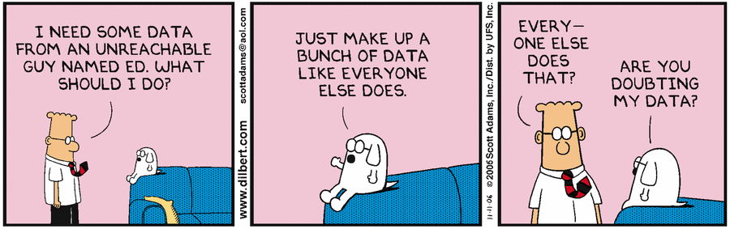

# How-to for junior data scientist

As part of my job I help junior data scientists (ds) to get magic into they tool set. Rather than doing same exercise over and over I decided to publish collections of quick how-to's in this repository to help data science guys keep up to speed. Note, typical ds is running on Windows desktop. My instructions are for those ds.

## Python environment
The easiest way to get all bits setup is to use Anaconda pre-compiled packages with package manager. To create new environment make sure you downloaded [Anaconda distribution](https://www.anaconda.com/download/) and run installer. Then open command prompt, navigate into local copy of this repo and create py3 env as shown below. The py3 environment is going to be our primary environment to run how-to demos.

```cmd
> cd <local_copy_howto-ds>
> conda env create -f environment\py3.yml
```

## Running a how-to

All how-to demos are in Jupiter notebook format. To run them, you need to start Jupiter notebook server inside py3 environment. Type commands shown below in command prompt 

```cmd
> activate py3
> jupyter notebook
```

Last command opens a new web page in your browser. Navigate to how-to of your choice and follow examples.

Remember, the most important thing that differentiates data scientist for others: all your conclusions come form data analysis. Don't trust your gut, **trust the data**!



Enjoy!


